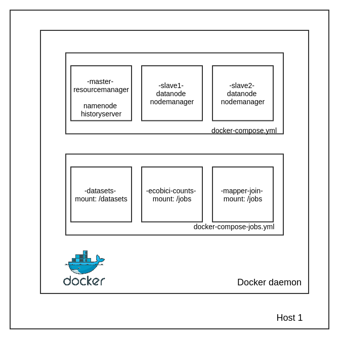

## Ejercicios de Hadoop dentro de Contenedores de Docker


### Cluster de hadoop en docker


#### Arquitectura cluster en docker



#### Levantar el cluster en docker

Para levantar el cluster solo es necesario construir las imagenes base y posteriormente iniciar los contenedores:

```
$ cd docker/
$ make build
$ make start
```

Revisar que los contenedores están arriba:

```
$ make status
```


### Usar cluster con streaming api


### Ejecutar los jobs de streaming api

Dentro del directorio docker se encuentran definidos los jobs como contendores en docker-compose-jobs.yml.
Antes de ejecutar los jobs es necesario cargar los datos a HDFS. Para ello hay que conectarse al cluster y ejecutar:

_Nota: suponiendo que los datasets mencionados en la tarea3 se encuentran en la carpeta ./datasets/_

```
$ cd docker/
$ make run-datasets
```

Dentro del container:
```
# hdfs dfs -mkdir -p /datasets/ecobici
# hdfs dfs -mkdir -p /datasets/flights
# hdfs dfs -copyFromLocal /datasets/ecobici/* /datasets/ecobici
# hdfs dfs -copyFromLocal /datasets/flights/* /datasets/flights
```

Posteriormente se pueden ejecutar los jobs individualmente, por ejemplo para los *counts per station* del dataset ecobici:

```
$ make run-ecobici-counts
```

Validar la salida dentro del container datasets:
```
$ make run-datasets
# hdfs dfs -ls /datasets/ecobici-count-per-station/
```
